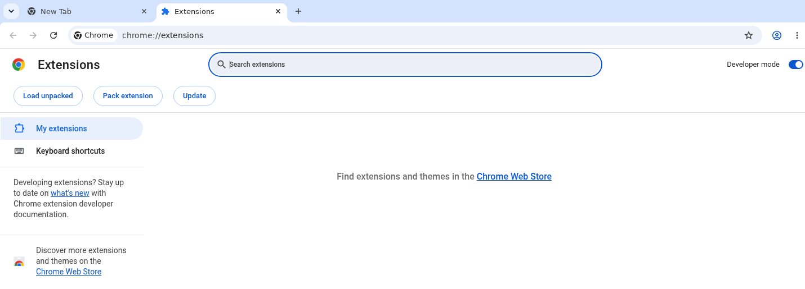
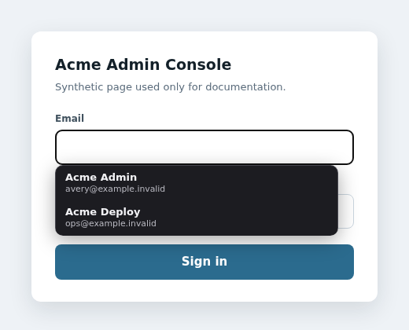

# Sans Password Manager browser extension

This folder contains one extension codebase for Chrome, Chromium, Edge, Brave,
Opera, Vivaldi, and Firefox desktop. It lists only accounts bound to the active
tab's hostname -- exactly, or through a scope a record opts into -- and fills
only the account you explicitly choose.

There are two ways in. The toolbar popup has been here since 3.1.0. Since
4.6.0 there is also an **in-field picker**: focus a login field and the
accounts bound to that site appear next to it.

## Recommended: guided one-command setup

```bash
./browser-extension-universal/setup.sh
```

The setup command detects your browser, builds the correct extension, registers
the native host, opens the browser's extension page and the prepared folder,
and prints the final three clicks. Nothing needs to be copied back into the
terminal.

To select a browser explicitly:

```bash
./browser-extension-universal/setup.sh --browser chrome
./browser-extension-universal/setup.sh --browser firefox
```

Use `--no-open` on a remote machine or when you only want to prepare the files.
Run `setup.sh --help` for the supported browser names.

The command leaves the browser on its extensions page. In Chrome, turn on
**Developer mode** at the top right, then choose **Load unpacked** at the top
left and select the folder the command printed:



This screenshot was captured in Chrome 151 with a disposable empty profile. It
contains no account, browsing, vault, or credential data.

The Chromium build carries a public development key that gives unpacked copies
the stable ID `infdncbkefpjncplegccokcfpiicadlo`. This is not a secret or a
signing credential; it only removes the old copy-ID-and-run-another-command
loop. Browser store signing remains separate. `extension-id.sh` derives that ID
from the manifest key exactly as the browser does, so the registration can
never drift from the identity the browser actually assigns.

### Upgrading from an earlier unpacked install

Earlier unpacked builds carried no key, so the browser derived the ID from the
directory path and every machine got a different one. Adding the key changes
that ID, and the browser treats the result as a separate extension. Remove the
previously loaded SPM entry from the extensions page before loading the new
one; otherwise the stale copy stays installed and its native-host registration
no longer matches. Re-running `install-host.sh` also rewrites any Chromium
manifest that was registered against an old ID.

## Manual installation

The guided flow is recommended. These steps remain available for
troubleshooting. Both variants are produced by `build.sh`, which writes the
generated `dist/chromium/` and `dist/firefox/` directories. That output is
local and is not committed.

```bash
./browser-extension-universal/build.sh chromium
./browser-extension-universal/build.sh firefox
```

### Chromium-family installation

1. Build the Chromium variant.
2. Open the browser's extensions page (`chrome://extensions`,
   `edge://extensions`, `brave://extensions`, or the equivalent).
3. Enable Developer mode and choose **Load unpacked**. Select
   `browser-extension-universal/dist/chromium`.
4. Register the native host, then fully restart the browser:

   ```bash
   ./browser-extension-universal/install-host.sh
   ```

### Firefox desktop installation

1. Build the Firefox variant.
2. Open `about:debugging#/runtime/this-firefox`, choose **Load Temporary
   Add-on**, and select `dist/firefox/manifest.json`.
3. Register the Firefox native host:

   ```bash
   ./browser-extension-universal/install-host.sh
   ```
4. Fully restart Firefox. Temporary add-ons must be loaded again after a
   Firefox restart; signed distribution is required for permanent installation.

## The boundary

The extension talks to SPM through one native-messaging host, and that host is
a contract rather than a pipe. Two halves:

**Inbound.** Four actions exist — `unlock`, `lock`, `list`, `get` — and an
action not named in the host's table is refused. The extension never chooses
what SPM command runs: each branch names a literal `bridge-*` command, so
there is no path from a message to an arbitrary CLI invocation. A hostname is
validated against a pattern and a record id must be digits.

**Outbound.** A response is *projected* onto the fields the action declares,
never forwarded:

| Action | Returns |
|---|---|
| `unlock` | `ok` only — the verdict, not the list used to reach it |
| `lock` | `ok` |
| `list` | `matches`, each row reduced to `id`, `label`, `username`, `url` |
| `get` | `username`, `password` |

This is the half worth having. `bridge-get` returns a username and a password
today; if it ever returns a note, a URL or a TOTP seed, that field cannot reach
the extension without someone editing the table — which is the review the
boundary exists to force. Forwarding whatever the CLI printed made the
extension's view of the vault whatever the CLI happened to print, which is not
a contract.

Failures are chosen from a fixed set of messages rather than echoed. An
unexpected error becomes a generic refusal, because a message like
`gpg: /home/you/.spm_vault.gpg: decryption failed` carries a filesystem path
across a boundary whose entire purpose is that nothing crosses unnamed.

**What the boundary does not do.** The original one-shot extension, still in
this repository, sends the master password with every `get` and holds no
session. That path is kept so it does not break, and it is not constrained by
**Lock** or by either timeout — a caller supplying the password directly has no
session for them to act on. That is a property of a one-shot protocol, not
something this table can close. The popup in this folder never sends the master
password except to `unlock`.

## The in-field picker

Unlock once through the toolbar popup. After that, focusing a username or
password field on a site you have accounts for opens a menu beside it: arrow
keys move through it, Enter or a click fills, Escape dismisses it, and the menu
never appears at all while SPM is locked.



Captured in Chromium against a synthetic login page on localhost with a
disposable vault. The accounts, usernames and page are synthetic.

The menu is an **iframe served from the extension's own origin**, not an
element injected into the page. That is the difference between "the page cannot
see your account list" and "the page probably cannot": an injected menu lives
in the page's document, and a page that wants to know which accounts you hold
can go and read it. The content script that positions the iframe is told how
many accounts matched and never which ones.

Four rules hold, and each has a test that fails if the code enforcing it is
removed:

- **A fill needs a real gesture.** Opening the menu does not -- a page can
  focus a field, and an open menu discloses nothing. Choosing an account
  requires an event the browser marked trusted, which page script cannot forge.
  A synthetic Enter fills nothing.
- **The hostname is read again at fill time**, from the browser rather than
  from anything the page frame claims about itself.
- **A login field inside a cross-origin iframe is never offered the picker**,
  and in fact no subframe is: telling a same-origin embed from a hostile one
  would need a permission worth more than the case it enables.
- **A record the picker did not offer cannot be filled through it**, so an
  https-bound record on an `http` page is neither listed nor reachable.

One thing a page can still infer: the overlay's height follows the number of
rows, up to four, so it learns roughly how many accounts you have for it. It
does not learn what they are. A fixed height would close that and would make a
one-account menu look broken.

The picker needs the extension to run on the pages it appears on, which is why
the manifest declares a content script for `http` and `https`. It does not add
the `tabs` or host permissions: the fill happens in the content script already
present, and the frame's URL arrives from the browser with every message. The
popup path still needs only `activeTab`.

Firefox for Android is not a verified target. The code is shared and the
manifest carries the same content script, but nothing here can run that
overlay on a touch keyboard at that viewport, so it is listed as unverified
rather than supported.

## Use

Open an HTTP(S) login page, select the SPM toolbar icon, enter the master
password once, and choose a matching account. The native host keeps the master
password only in process memory. **Lock SPM** discards it immediately. It is
also discarded after five idle minutes, after twelve total hours, when the
native connection ends, or when the browser closes.

Matching is exact by default: `example.com` does not match
`login.example.com`. A record opts into a wider scope by writing one into its
URL field, `https://*.example.com`, which covers that host and every host
beneath it. The wildcard is never inferred from a bare hostname, and
`https://*.com` is refused. The CLI re-verifies the hostname again when the
chosen credential is retrieved.

A record bound to an `https://` URL is refused on an `http://` page, and is not
offered in the picker there either. The popup sends the page's scheme with
every request; a build older than 4.5.0 does not, and is refused for
https-bound records until it is reloaded.

Reload the extension after upgrading to 4.6.0 as well: it gains a content
script, and a browser does not start running one for an extension it already
has loaded.

Safari and iOS browsers are not supported: Safari requires a signed Xcode app
wrapper and iOS browsers do not expose this native-messaging extension model.
Use the installable SPM Dashboard web app on iOS.
